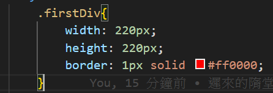
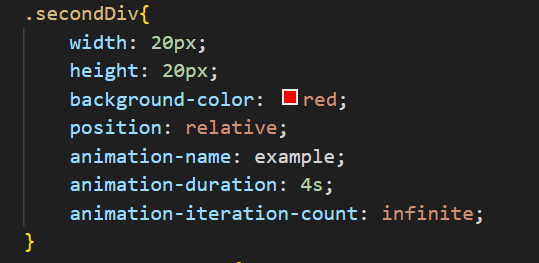
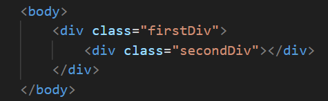

# 第3次隨堂-隨堂-QZ3
>
>學號：111111211
> 
>姓名：李俊威
> 
>作業撰寫時間：30 (mins，包含程式撰寫時間)
> 
>最後撰寫文件日期：2023/12/24
>

本份文件包含以下主題：(至少需下面兩項，若是有多者可以自行新增)
- [x] 說明內容
- [x] 個人認為完成作業須具備觀念

## 說明程式與內容
先在head中加入style的標籤
 
設定外框

設定小格
 
並且使用animation-name、nimation-duration、animation-iteration-count分別設定動畫名稱定義、動畫播放時間、動畫執行次數。

最後套用到body中

## 個人認為完成作業須具備觀念
本次隨堂中所需具備的能力為上所教的語法，利用"animation"結合"@keyframes"搭配組合出動畫效果的技術，使網頁整體更活躍豐富。
